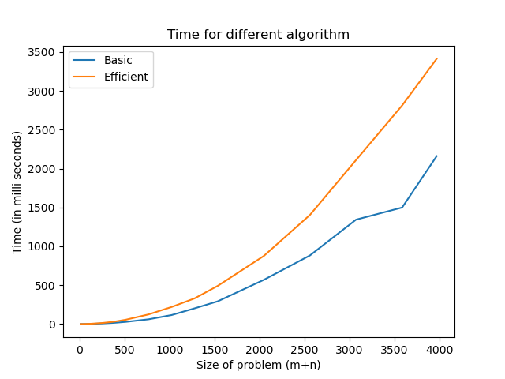
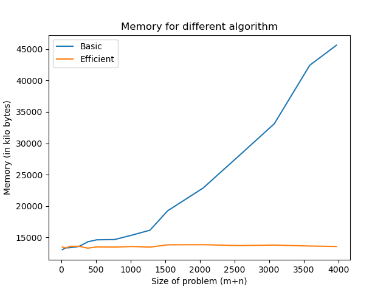

# Course Project for CSCI570 (Analysis of Algorithms) Fall 2022 USC

## Group Members
1. Nikita Maid
2. Praveen Iyer
3. Trishala Ahalpara

## About the project
For sequence alignment problem, we have implemented 2 versions - basic and efficient. 

For the basic version, the algorithm implemented can be found [here](https://www.geeksforgeeks.org/sequence-alignment-problem/).  

For the efficient version, the algorithm implemented can be found [here](https://en.wikipedia.org/wiki/Hirschberg%27s_algorithm).

The time complexity vs input size can be shown below.

  
The memory complexity vs input size can be shown below.
